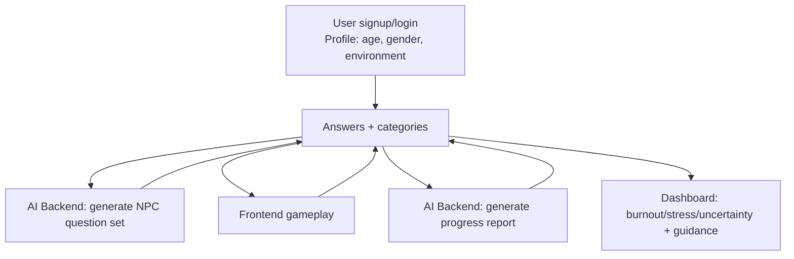

# Mindtrail (Team 59) — Full Stack Project

## Description
Mindtrail is a gamified mental-health web experience built for the Nepal–US Hackathon 2026. The project includes:
- A **frontend** (Vite + TypeScript) with a pixel-art **2D Canvas game**, NPC dialogues, and a user dashboard.
- A **backend API** (NestJS + Prisma + PostgreSQL) for auth, game sessions, and progress reports.
- An **AI service** (FastAPI) used to generate NPC questions and progress-report insights.

Mindtrail turns a mental-health journey into an interactive game. After a user signs up and shares a small amount of profile context such as age, gender, and environment, the system generates personalized NPC scenarios that reflect situations the user is more likely to relate to, such as school pressure, workplace stress, relationship tension, uncertainty, burnout, or support-seeking moments. Instead of presenting a static questionnaire, the game lets the player move through a world, meet NPCs, respond to emotionally grounded prompts, and make choices in context.

Behind the scenes, the backend and AI service work together to generate structured question sets, categorize answer choices for later analysis, and store completed sessions for reporting. Redis is used to prefetch the next question set so the gameplay experience feels faster, while PostgreSQL stores actual sessions, answers, and report history. After a session ends, the AI pipeline summarizes the player’s patterns into a progress report with burnout, stress, and uncertainty indicators plus short actionable feedback, so the application is not only a game but also a reflective tool for mental-health awareness.

## What the Application Does
- Creates a story-driven mental-health game instead of a traditional form-based assessment
- Generates environment-aware NPC questions from user profile context such as age, gender, and environment
- Lets users respond to NPC situations inside the game world and records their selected response categories
- Prefetches upcoming question sets so new sessions feel quicker to start
- Produces AI-assisted progress reports after gameplay, including analysis and supportive feedback
- Gives users a dashboard view to revisit their progress over time

## Live Demo
- App: `http://100.54.109.124/TEAM-59/`
- You can register your account and also you can directly login using this account email: `riya12@gmail.com` password `riya1234`
- Backend Swagger: `http://100.54.109.124/api/docs`
- AI Swagger: `http://100.54.109.124/docs`

## Screenshots / Demo


## Architecture


## AI Structure (Pipeline)


## Repo Structure
- `frontend/` — Vite + TypeScript game UI
- `backend/` — NestJS API (Prisma + PostgreSQL + Swagger)
- `ai-backend/` — FastAPI service (OpenAI-based generation)
- `docs/backend-setup.md` — Original detailed backend setup notes

## Setup and Installation Instructions

### Prerequisites
- Node.js (20+ recommended) + npm
- PostgreSQL (14+)
- Python (3.12+ for `ai-backend/`)

Optional:
- Redis (used by the backend for prefetch/locking; see `backend/.env.example`)

---

### 1) Backend (NestJS API)
```bash
cd backend
npm install
cp .env.example .env
```

Edit `backend/.env` (at minimum: `DATABASE_URL`, `JWT_SECRET`, `FRONTEND_ORIGIN`, `AI_BACKEND_URL`).

Create DB + run migrations + seed:
```bash
cd backend
npm run prisma:generate
npm run prisma:migrate -- --name init
npm run seed
```

Start backend:
```bash
cd backend
npm run start:dev
```

Backend URLs:
- API: `http://localhost:3001/api`
- Swagger UI: `http://localhost:3001/api/docs`

---

### 2) AI Backend (FastAPI)
FastAPI service that generates NPC questions and produces progress reports from game sessions.

**Requirements**
- Python 3.12+

```bash
cd ai-backend
python -m venv venv
source venv/bin/activate  # Windows: venv\Scripts\activate
pip install -r requirements.txt
cp .env.example .env
```

Set your API key in `ai-backend/.env`:
```env
OPENAI_API_KEY=...
```

Environment:
- `OPENAI_API_KEY`: OpenAI API key

Run the service:
```bash
cd ai-backend
uvicorn main:app --reload --host 0.0.0.0 --port 8000
```

AI URLs (default):
- Health: `http://localhost:8000/health`
- Docs: `http://localhost:8000/docs`
- Report generation is served by the same AI backend and uses the same `OPENAI_API_KEY`

Make sure `backend/.env` points `AI_BACKEND_URL` to this service, e.g.:
```env
AI_BACKEND_URL=http://localhost:8000
```

---

### 3) Frontend (Vite + TypeScript)
```bash
cd frontend
npm install
```

Configure dev proxy in `frontend/.env` (example):
```env
VITE_API_PROXY_TARGET=http://localhost:3001
VITE_API_PROXY_TIMEOUT_MS=300000
```

Run dev server:
```bash
cd frontend
npm run dev
```

Build:
```bash
cd frontend
npm run build
```

## Usage
1. Start the backend + AI backend.
2. Start the frontend.
3. Register / log in.
4. From the hub/dashboard:
   - Choose an avatar.
   - Enter the world and talk to NPCs.
   - Select answers (submitted to the backend).
5. When the game ends, the session is ended and a **progress report** is generated; open **YOUR PROGRESS** to view it.

## Technologies Used
**Frontend**
- TypeScript, Vite
- HTML Canvas (2D)
- Vanilla CSS

**Backend**
- NestJS (TypeScript)
- Prisma + PostgreSQL
- Swagger (OpenAPI)
- Redis (optional)

**AI Service**
- FastAPI + Uvicorn
- OpenAI SDK

## Team Members
- Bitisha Maharjan 
- Riya Maharjan 
- Swopnil Maharjan 
- Bijen Shrestha
- Suyan Shrestha 

## Contact / Notes
- Frontend proxy setup: `frontend/vite.config.ts` + `frontend/.env`
- Backend environment reference: `backend/.env.example`
- If you’re demoing without external network access, make sure the AI backend is running locally and `AI_BACKEND_URL` points to it.
